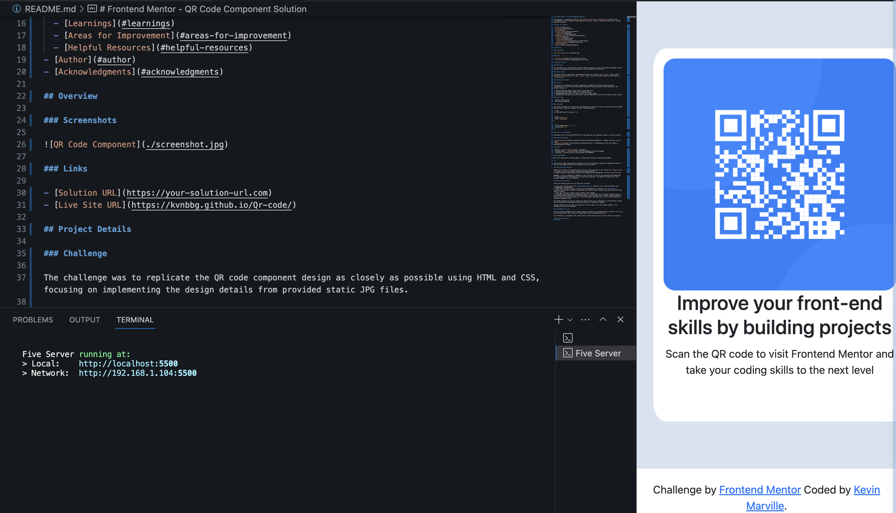

# Frontend Mentor - QR Code Component Solution

This project is a solution to the [QR code component challenge on Frontend Mentor](https://www.frontendmentor.io/challenges/qr-code-component-iux_sIO_H), aimed at enhancing coding skills through practical projects.

## Table of Contents

- [Overview](#overview)
- [Screenshots](#screenshots)
- [Links](#links)
- [Project Details](#project-details)
  - [Challenge](#challenge)
  - [Design Files](#design-files)
- [Building the Project](#building-the-project)
  - [Process](#process)
  - [Tools Used](#tools-used)
  - [Learnings](#learnings)
  - [Areas for Improvement](#areas-for-improvement)
  - [Helpful Resources](#helpful-resources)
- [Author](#author)
- [Acknowledgments](#acknowledgments)

## Overview

### Screenshots



### Links

- [Solution URL](https://www.frontendmentor.io/solutions/qr-master-fast-code-generator-s3RZDcsxVp)
- [Live Site URL](https://kvnbbg.github.io/Qr-code/)

## Project Details

### Challenge

The challenge was to replicate the QR code component design as closely as possible using HTML and CSS, focusing on implementing the design details from provided static JPG files.

### Design Files

The design files for both mobile and desktop versions are located in the `/design` folder. Assets necessary for the project are in the `/images` folder, while style guide details are available in `style-guide.md`.

## Building the Project

### Process

The project was initiated as a public repository on GitHub to facilitate code sharing and collaboration. It was structured using HTML5 markup and styled using CSS custom properties. The workflow involved:

1. Understanding the design layout from the provided files.
2. Writing structured HTML content before adding styles.
3. Implementing base styles for fonts, sizes, and content layout.
4. Step-by-step styling from top to bottom, ensuring completion of each section before moving forward.

### Tools Used

- Semantic HTML5 markup
- CSS custom properties

### Learnings

The primary learning from this project was deploying the website for free, along with reinforcing HTML and CSS skills. Here are snippets of code I found noteworthy:

```html
<h1>Some HTML code I'm proud of</h1>
```

```css
.proud-of-this-css {
  color: papayawhip;
}
```

```js
const proudOfThisFunc = () => {
  console.log("🎉");
};
```

### Areas for Improvement

Continued focus on refining HTML/CSS skills and exploring more advanced concepts in future projects.

### Helpful Resources

- [CSS Documentation](https://developer.mozilla.org/en-US/docs/Web/CSS) - Valuable resource for XYZ reason.
- [Google Fonts](https://fonts.google.com/specimen/Outfit) - Enlightening article that aided in understanding XYZ concept.

## Author

- Website - [Author's Website](https://kvnbbg.fr)
- Frontend Mentor - [@kvnbbg](https://www.frontendmentor.io/profile/kvnbbg)
- Instagram - [@kvnbbg](https://www.instagram.com/kvnbbgnew)

---

## Sharing your solution

There are multiple places you can share your solution:

1. Share your solution page in the **#finished-projects** channel of the [community](https://www.frontendmentor.io/community).
2. Tweet [@frontendmentor](https://twitter.com/frontendmentor) and mention **@frontendmentor**, including the repo and live URLs in the tweet. We'd love to take a look at what you've built and help share it around.
3. Share your solution on other social channels like LinkedIn.
4. Blog about your experience building your project. Writing about your workflow, technical choices, and talking through your code is a brilliant way to reinforce what you've learned. Great platforms to write on are [dev.to](https://dev.to/), [Hashnode](https://hashnode.com/), and [CodeNewbie](https://community.codenewbie.org/).

We provide templates to help you share your solution once you've submitted it on the platform. Please do edit them and include specific questions when you're looking for feedback.

The more specific you are with your questions the more likely it is that another member of the community will give you feedback.

## Got feedback for us?

We love receiving feedback! We're always looking to improve our challenges and our platform. So if you have anything you'd like to mention, please email hi[at]frontendmentor[dot]io.

This challenge is completely free. Please share it with anyone who will find it useful for practice.

**Have fun building!** 🚀
# Qr-code
